# Investing in 2018 Real Estate

Vega Capital is an real estate investment firm with $2 billion in AUM. The main strategy of their investment fund has historically been in commercial real estate but they would like to diversify their strategy into investing in single and multi family homes. They have tasked our consulting group with providing them 5 zip codes in the US they should invest in with a time horizon of 5 years. Given this is their first time delving into the single/multi-family home market it is of the utmost importance they are able to provide sufficient risk adjusted returns to their investors in order to encourage future fundraising rounds.

## Data

The Data used in this project included Zillow Mean Home Price data for 14,000+ zipcodes from 1996-2018. This data was supplemented with US Treasury 10 Year Note rates for the same period as they were needed our selection processes 

* Zillow Research Group
* The Federal Reserve Economic Data - https://fred.stlouisfed.org/series/DGS10

Main files used:

* zillow_data.csv
* DGS10.csv

The Zillow data provided many classifying columns such as City, State, County as well as Zipcodes. Example below.

## Business Problem

The main business concern is that Vega is successful in entering the Single Family/ Multi-Family Market and can provide their investors sufficient return. The average 5 year return for a REIT is around 15% so that is the benchmark minimum that we will be held to. In order to come up with the top 5 zipcodes for Vega to invest in we needed to do our due diligence scouring housing data across the US in order to identify trending states and cities that are outperforming the market.

To deliver for our client, we need to: 

    1. Provide 5 Zipcodes with a minimum 15% 5 year return
    2. Create a Time Series model and forecast 5 year returns for above mentioned zipcodes

## Methods

### Preprocessing

First step of our long journey to discovering the top 5 zip codes to invest in began with cleaning our dataset. There were missing values but given we were dealing with time series data we were able to back fill missing data. The first concern was dealing with wide-format data for our mean home prices but this was dealt with after we grouped our data by whichever relevant field and transposed our data. Our process was quite iterative to go through the different groupings, but prior to exploring the data for each grouping the data was converted into a data from from the groupby, transposed and removed an empty row. Next the index needed to be converted to datetime

### Transformation

Transforming our data was quite an important stage as for our strategy for isolating investment opportunities we wanted to focus on risk adjusted return or otherwise known as the sharpe ratio. In order to do this we needed to first import a risk free rate of return as given by the United States 10 Year Treasury Note. This data was pulled in from the Federal Reserve Economic Data website.

This dataset itself was quite easy to manage it needed minimal cleaning and was shaped to match our datetime index we had for our housing data.

Once our different fields were grouped we needed to first create a column for return on investment which we wanted to see both annually and monthly. Additionally, created columns for exponential weighted moving average for ROI YOY, ROI MOM, as well as standard deviation for both frequencies. Once we had all of these columns we were then able to derive our sharpe ratio which is:

Return on Investment for a given frequency(annual,monthly) - Risk Free Rate of Return(UST 10 Year Note yield) / Standard Deviation of Returns

Our process included creating a list of dataframes for all of the given subgroupings i.e. State, County, Cities or relevant ones we wanted to investigate. We then used for loops to iterate through each dataframe to get to our sharpe ratio. Additionally, we created another dataframe with averages for the 1, 3 , 5, and 10 year time horizons which we would use in our EDA

### Data Mining (EDA)

As I briefly touched on above, our process to identify the best zipcodes was an iterative one. We first grouped our data at the State level where we were able to narrow our scope to 14 states. This included two groups of states, states with the best sharpe ratio for a 5 year time horizon and for a 1 year time horizon. The idea was to capture high performing states as well as states that were trending up. This is technique is used at each level so that was to varying degress

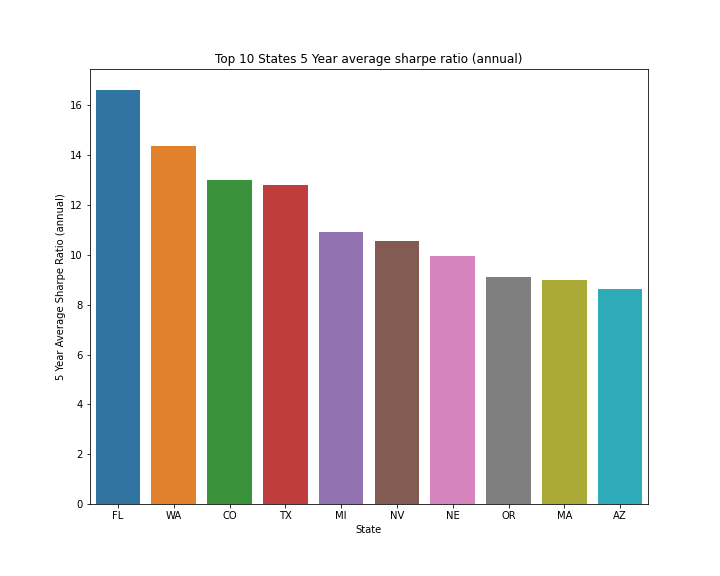
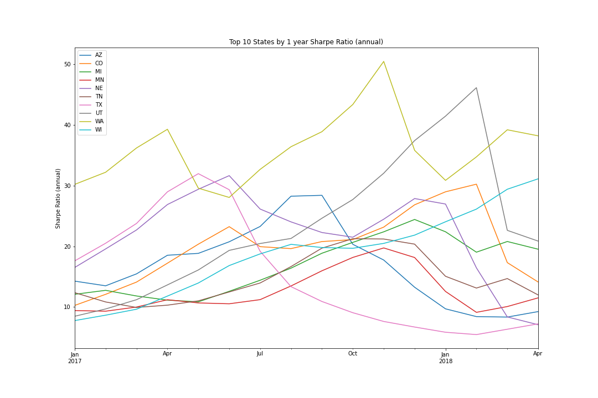
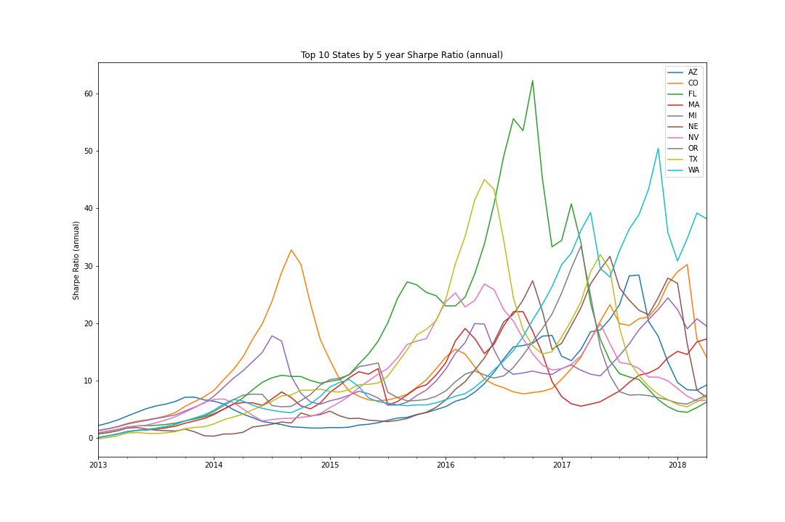

As directed by our highest sharpe ratios and upward trending sharpe ratios we selecte the following 14 states to further investigate: 

AZ, CO, FL, MA, MI, MN, NE, NV, OR, TN, TX, UT, WA, and WI

We repeated the same process with the above states for counties and investigated the following graphs

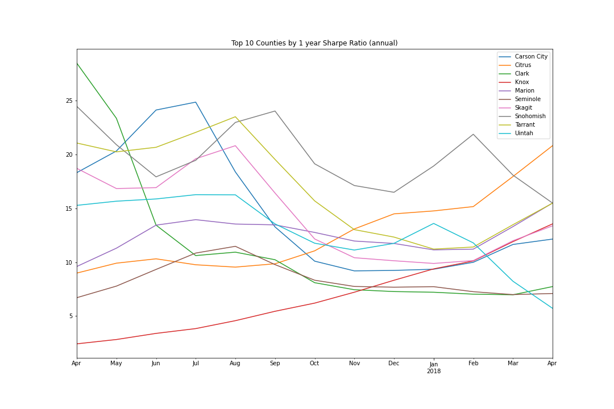
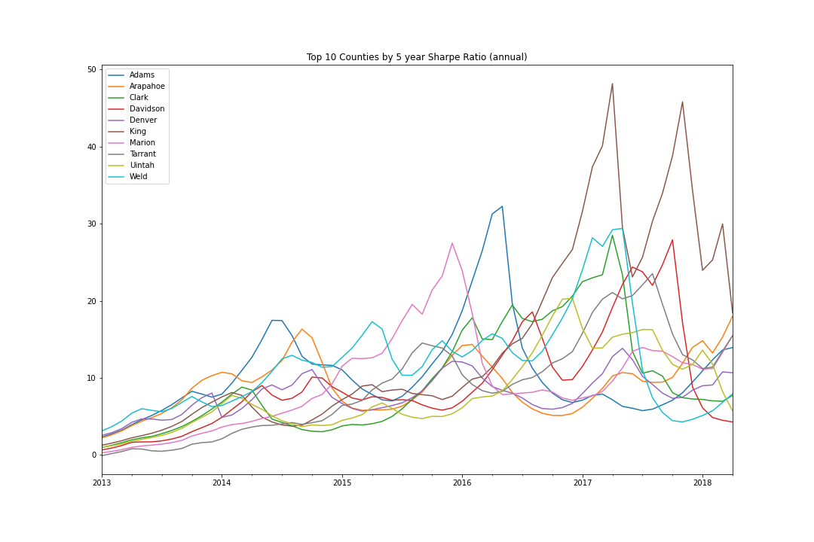
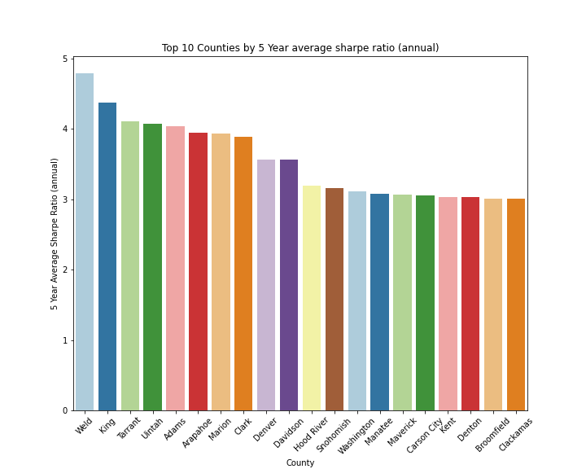

After investigating counties, I decided not to trim our overall list of counties prior to moving onto cities. I was concerned with cities that may be excluded because the average sharpe may have been brought down by less perfomring cities in the county. 

However, counties of interest from this round were Araphoe, Tarrant, King, and Weld, 

The final cities inlcuded from our investigation yielded the following:

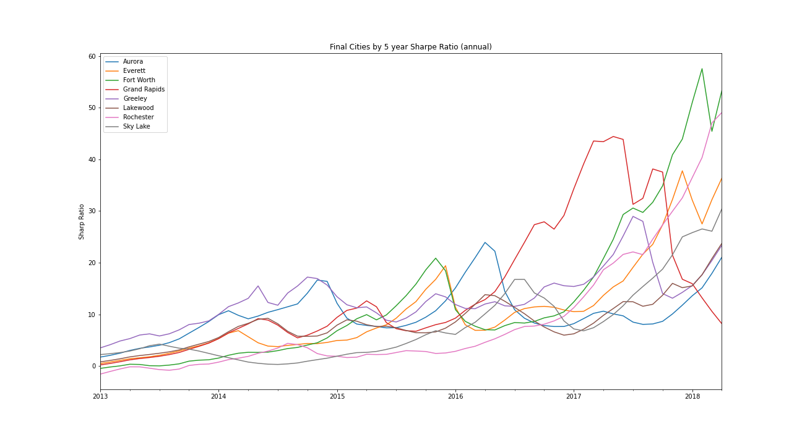

Final cities we decided on were Aurora, Greeley, Lakewood, Fort Worth, Everett, Sky Lake, Rochester, and Grand Rapids. These cities include a blend of reasons to invest. Aurora and Greeley have some of the highest Sharpe ratios in both the 1 and 5 year time periods and are trending up in the 1 year period

Fort Worth and Sky Lake have extremely high Sharpe Ratio for the most recent 1 year period. Their longer term averages are lower than the other cities but that to me points to higher future potential return given these cities are not at extended prices yet relative to others i.e. average home price as of 2018 are both around 180k

Rochester and Everett are high performing cities across time periods and trending up.

Lastly, Grand Rapds had high averages but is downward trending. I added it to the list to see if perhaps there are select zipcodes within the city that are trending up and for diversification purposes

After isolating zipcodes in the above chosen zipcodes we came to find the follwoing zipcodes for our modeling. Their respective 1 and 5 year sharpe ratio graphs are as follows

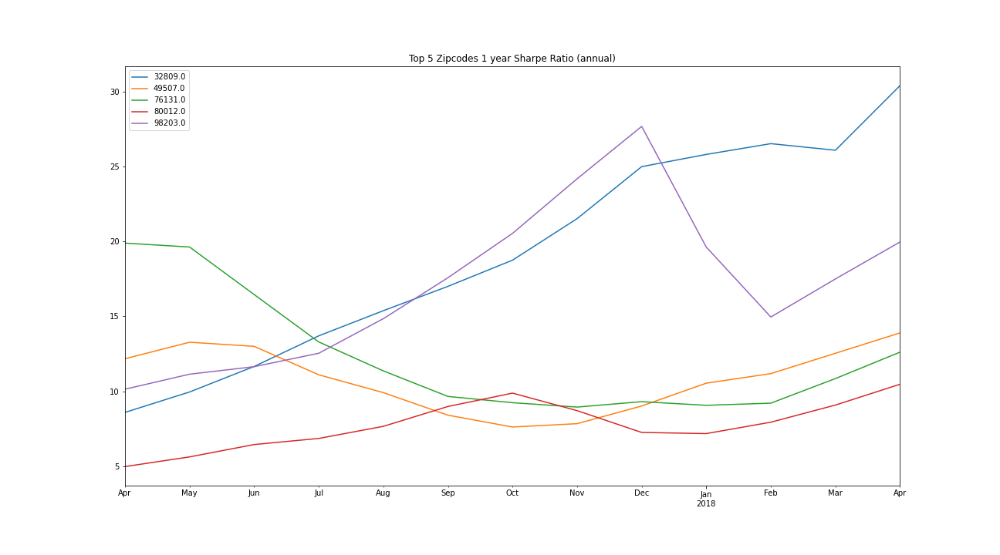
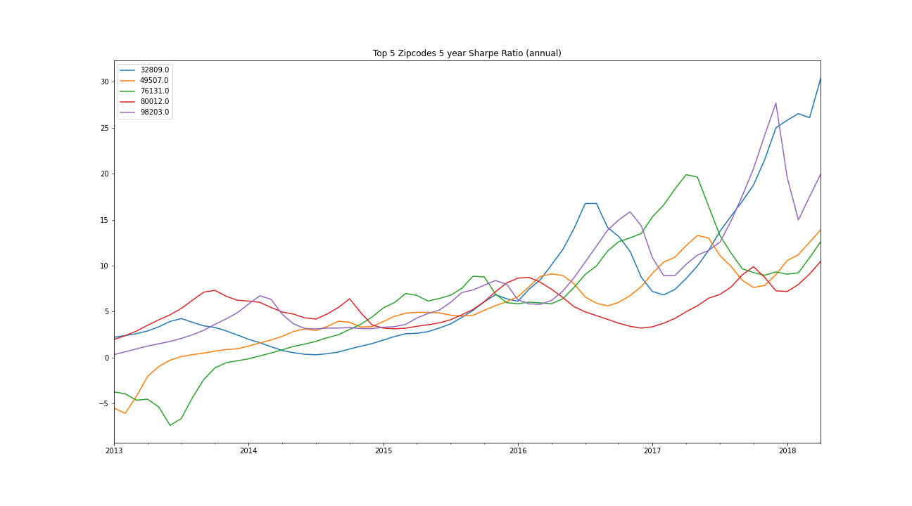
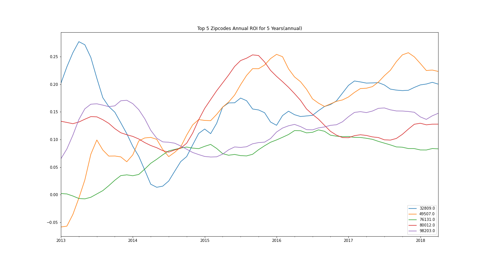

Our final zipcodes were in Sky Lake, FL, Fort Worth, TX, Aurora, CO, Grand Rapids, MI, and Everett, WA

For context the final plot shows the annual ROI from 2013 - 2018 which are above our benchmark of 15%

## Results

After running a SARIMAX times series model on the top five zipcodes for the above mentionded cities, we were able to provide our simulated results for the upcoming 5 years across ROI, Sharpe Ratio, and price.

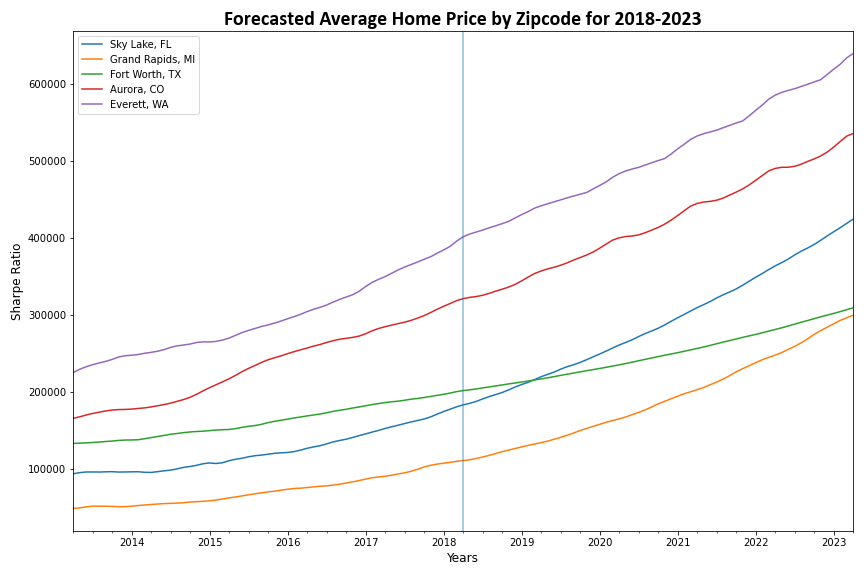

In the above plots, we can se both that for our selected zipcodes all of them are trending up in average home price, which is to be expected at the very least. Lets see what this translates to in ROI terms.

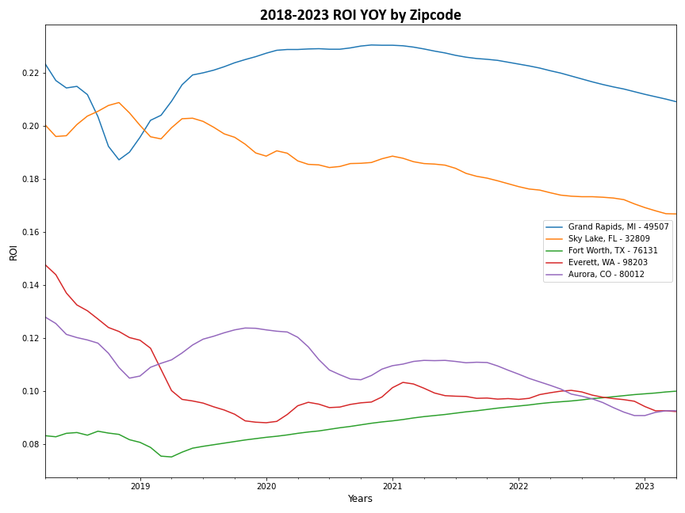

Here we can see clearly defined outperformers and underperformers from our selected zipcodes, but to note these are annual returns for 5 years so they slighlty understate the full return to be received. That aside our best performing zipcode by ROI is clearly 49507 Grand Rapids, MI followed by 32809 Sky Lake, FL

Coming to Sharpe Ratios, first we would like to note that this was calculated with a forecasted US 10 Year Treasury Note Yield which certainly different than actual for the period, but to remain consistent throughout our process this made the most sense.

Now, here we can really see the standout in performance of Grand Rapids and Sky Lake. Average home prices in Grand Rapids are projected to more than triple in 2021 and Sky lake to double. This isn't to say that performance of our other zipcodes is bad they are all around at least the 50 level which is still extremely high for this metric.

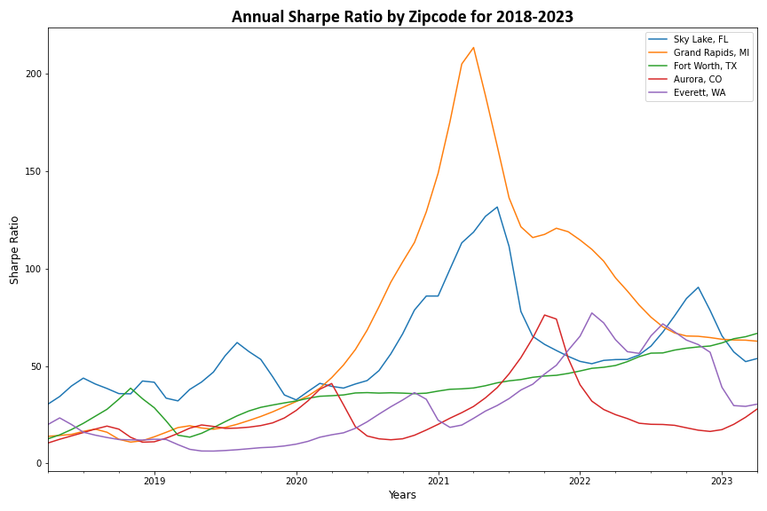

So as we can see both our Sharpe Ratios and ROI are quite high for our 5 year forecasts, but lets look at the numbers to really get a feel for our predictions.

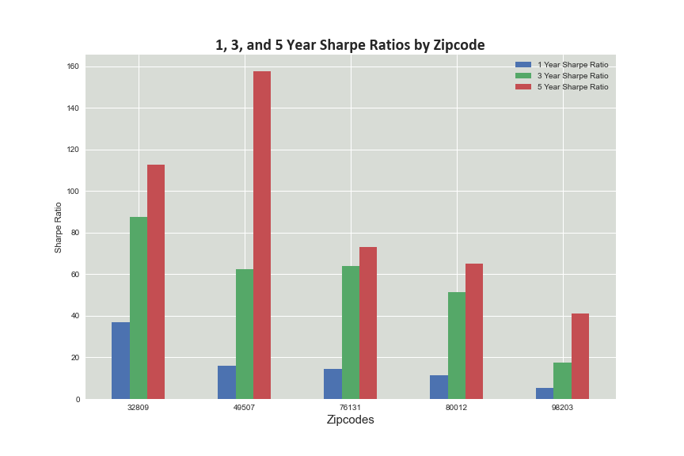

Our process was to highlight investment opportunities on the basis of risk adjusted returnsto which we turned to the sharpe ratio as our primary metric. That being said, once we've forecasted 5 years out that metric is slightly less reliable than ROI given it relies on our forecast of the 10 year note. So now that we've forecasted out 5 years our primary metric is ROI of which we see above.

For the 5 year period, Grand Rapids is projected to return 169%, but notably all of our zipcodes chosen are forecasting 50% returns. 

## Conclusion

We were tasked with providing 5 zipcodes that were the best investment opportunities for Vega Capital and its investors. We provided them with 5 opportunities that all forecasted at least 50% return and on the LOW end of the spectrum and as high as 169% over the 5 year period. Granted this is subject to outside factors like anything else, but as a baseline all of our forecasts at a minimum meet our 5 year threshold of 15% return.

Grand Rapids, MI Zipcode 32809 was the best investment opportunity in terms of ROI, followed by Sky Lake FL - 32809 at 131%.

Notably, the returns are clearly significant, but also it is important to note the properties that were selected are diversified across States and Cities, which should provide another layer of protection to the performance of the portfolio.

Time to go house hunting

## Future Work

The scope of this project solely looks at price appreciation of homes in terms of buying and selling a home outright. It would interesting to analyze properties that could be converted into income streams of rental income as well and how that would change the return for each property.

Additionally, it would appropriate to include the full scope of costs incurred to buy a home as this analysis solely looks at price appreciation. In a real world scenario, there are legal fees, service fees, and the like to purchasing and selling homes that are not taken into account to our rate of return.
